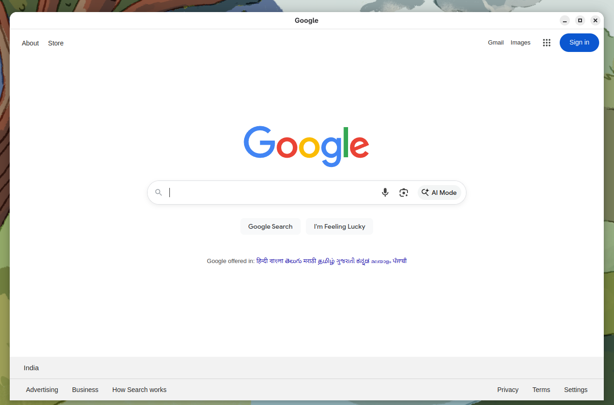

# Website to Desktop App

> Turn any website into a secure, standalone desktop application in minutes — powered by Electron.



[](LICENSE)
[](#building-on-windows-step-by-step-from-scratch)
[](https://www.electronjs.org)
[](https://nodejs.org)

---

## What is this?

**Website to Desktop App** wraps any URL into a native desktop window — no browser chrome, no address bar, no way for users to navigate away. Drop in a URL, build, and distribute a polished `.exe`, `.dmg`, or `.AppImage`.

Perfect for:
- Internal tools and dashboards that need a desktop presence
- Kiosk / display mode applications
- Locking users to a single web app (ERP, CRM, SaaS)
- Giving a web app a native feel without rewriting it

---

## Features

- **One config file** — change the URL, app name, and window size in `config.json`, done
- **Cross-platform builds** — Windows (NSIS installer + portable), macOS (DMG), Linux (AppImage + DEB)
- **Security hardened** — DevTools blocked, context menu disabled, navigation restricted to the configured origin, sandbox enabled
- **Persistent sessions** — cookies and localStorage survive app restarts and reinstalls
- **Kiosk mode** — fullscreen lock with a single config flag
- **Offline error screen** — built-in loading/error page shown when the network is unavailable
- **Single instance** — prevents multiple windows from opening at the same time

---

## Quick Start

```bash
# 1. Clone the repo
git clone https://github.com/your-username/website-desktop-app.git
cd website-desktop-app

# 2. Edit config.json — set your URL and app name
# 3. Install dependencies
npm install

# 4. Run in development mode
npm run dev

# 5. Build for your platform
npm run build        # Windows
npm run build:mac    # macOS
npm run build:linux  # Linux
```

---

## Configuration

Edit `config.json` at the project root — no code changes needed:

```json
{
  "url": "https://your-website.com",
  "appName": "My App",
  "kiosk": false,
  "windowWidth": 1280,
  "windowHeight": 800
}
```

| Key           | Default | Description |
|---------------|---------|-------------|
| `url`         | `https://google.com` | The website to load on startup |
| `appName`     | hostname of `url` | Window title and OS app name |
| `kiosk`       | `false` | `true` for fullscreen kiosk mode |
| `windowWidth` | `1280`  | Default window width in pixels |
| `windowHeight`| `800`   | Default window height in pixels |

---

## Building on Windows (Step-by-Step from Scratch)

Follow these steps on a fresh Windows machine that has nothing installed.

### Step 1: Install Node.js

1. Open a browser and go to: https://nodejs.org
2. Download the **LTS** version (the big green button on the left). This will download a file like `node-v22.x.x-x64.msi`.
3. Double-click the downloaded `.msi` file to run the installer.
4. Click **Next** through the wizard. Accept the license agreement.
5. On the "Tools for Native Modules" screen, check the box **"Automatically install the necessary tools"** — this installs build tools that electron-builder may need.
6. Click **Install**, then **Finish**.
7. **Restart your computer** (recommended to ensure PATH is updated).

### Step 2: Verify Installation

1. Press `Win + R`, type `cmd`, press Enter to open Command Prompt.
2. Run these commands to verify:

```cmd
node --version
npm --version
```

You should see version numbers (e.g., `v22.x.x` and `10.x.x`). If you get "not recognized", restart your PC and try again.

### Step 3: Copy the Project

Copy the entire `website-desktop-app` folder to your Windows machine. You can use a USB drive, file share, or zip and transfer it. Place it somewhere convenient, for example:

```
C:\Users\YourName\Desktop\website-desktop-app
```

**Important:** Do NOT copy the `node_modules` folder or `dist` folder — they will be regenerated on Windows.

### Step 4: Install Dependencies

1. Open Command Prompt (`Win + R` → `cmd` → Enter).
2. Navigate to the project folder:

```cmd
cd C:\Users\YourName\Desktop\website-desktop-app
```

3. Install all dependencies:

```cmd
npm install
```

This will take a few minutes. It downloads Electron (~150 MB) and all other packages. Wait for it to finish without errors.

### Step 5: Test the App (Optional)

Run the app in development mode to make sure everything works:

```cmd
npm run dev
```

The app should open and load the configured website. Press `Ctrl+C` in the terminal to close it.

To test in production mode (DevTools blocked):

```cmd
npm start
```

### Step 6: Replace the App Icon (Optional but Recommended)

Replace `assets/icon.png` in the project folder with your actual logo:

- Must be at least **256x256 pixels**
- PNG format
- For best results on Windows, also create an `icon.ico` file (use an online converter like https://convertio.co/png-ico/) and update `package.json`:

```json
"win": {
  "icon": "assets/icon.ico"
}
```

### Step 7: Build the Windows Executable

```cmd
npm run build
```

This takes several minutes on the first run. When finished, the output is in the `dist` folder:

```
dist/
├── Website Desktop App Setup 1.0.0.exe    ← NSIS installer (for end users)
├── Website Desktop App 1.0.0.exe          ← Portable executable (no install needed)
└── win-unpacked/                           ← Unpacked app directory
```

### Step 8: Distribute

- **For most users:** Share the `Website Desktop App Setup 1.0.0.exe` installer. Users double-click it, it installs, and creates a desktop shortcut.
- **For USB/portable use:** Share the `Website Desktop App 1.0.0.exe` portable file. It runs without installation.

---

## Building on macOS (Step-by-Step from Scratch)

> **Note:** macOS builds must be run on a Mac. You cannot cross-compile a `.dmg` from Windows or Linux.

### Step 1: Install Node.js

**Option A — Official installer (recommended for beginners):**

1. Go to https://nodejs.org and download the **LTS** `.pkg` installer.
2. Double-click the downloaded file and follow the prompts.
3. Open **Terminal** (Applications → Utilities → Terminal) and verify:

```bash
node --version
npm --version
```

**Option B — Homebrew (recommended for developers):**

```bash
# Install Homebrew if not already installed
/bin/bash -c "$(curl -fsSL https://brew.sh/install.sh)"

# Install Node.js LTS
brew install node@22
```

### Step 2: Clone or Copy the Project

```bash
cd ~/Desktop
# If you have the folder as a zip, extract it there.
# Otherwise copy the website-desktop-app folder here.
cd website-desktop-app
```

**Important:** Do NOT copy the `node_modules` or `dist` folders.

### Step 3: Install Dependencies

```bash
npm install
```

### Step 4: Test the App (Optional)

```bash
# Development mode (DevTools enabled)
npm run dev

# Production mode (DevTools blocked)
npm start
```

### Step 5: Replace the App Icon (Optional but Recommended)

Replace `assets/icon.png` with your logo (min **256×256 PNG**).

For macOS, you can also provide an `.icns` file for best results. Convert using Preview or an online tool, then update `package.json`:

```json
"mac": {
  "icon": "assets/icon.icns"
}
```

### Step 6: Build the macOS App

```bash
npm run build:mac
```

Output in `dist/`:

```
dist/
├── Website Desktop App-1.0.0.dmg        ← DMG installer (drag-to-Applications)
├── Website Desktop App-1.0.0-mac.zip    ← Zipped .app bundle
└── mac/
    └── Website Desktop App.app          ← Unpacked app bundle
```

### Step 7: Distribute

- **For most users:** Share the `.dmg` file. Users open it, drag the app to `/Applications`, and launch it from there.
- **Note on Gatekeeper:** Unsigned apps will show a warning on first launch. Users can right-click → **Open** to bypass it, or you can sign the app with an Apple Developer certificate.

---

## Building on Linux (Step-by-Step from Scratch)

### Step 1: Install Node.js

**Ubuntu / Debian:**

```bash
# Install Node.js LTS via NodeSource
curl -fsSL https://deb.nodesource.com/setup_lts.x | sudo -E bash -
sudo apt-get install -y nodejs

# Verify
node --version
npm --version
```

**Fedora / RHEL / Rocky:**

```bash
sudo dnf install nodejs npm
```

**Arch Linux:**

```bash
sudo pacman -S nodejs npm
```

**Any distro (via nvm — recommended):**

```bash
curl -o- https://raw.githubusercontent.com/nvm-sh/nvm/v0.39.7/install.sh | bash
source ~/.bashrc   # or ~/.zshrc
nvm install --lts
```

### Step 2: Install Build Dependencies

Electron requires some native build tools on Linux:

```bash
# Ubuntu / Debian
sudo apt-get install -y build-essential libssl-dev

# Fedora
sudo dnf groupinstall "Development Tools"
```

### Step 3: Clone or Copy the Project

```bash
cd ~/Desktop
# Copy or extract the website-desktop-app folder here
cd website-desktop-app
```

**Important:** Do NOT copy the `node_modules` or `dist` folders.

### Step 4: Install Dependencies

```bash
npm install
```

### Step 5: Test the App (Optional)

```bash
# Development mode (DevTools enabled)
npm run dev

# Production mode (DevTools blocked)
npm start
```

### Step 6: Replace the App Icon (Optional but Recommended)

Replace `assets/icon.png` with your logo (min **256×256 PNG**).

### Step 7: Build the Linux Package

```bash
npm run build:linux
```

Output in `dist/`:

```
dist/
├── Website Desktop App-1.0.0.AppImage   ← Portable, runs on any distro
├── website-desktop-app_1.0.0_amd64.deb  ← Debian/Ubuntu installer
└── linux-unpacked/                       ← Unpacked app directory
```

### Step 8: Run / Distribute

**AppImage** — portable, no installation needed:

```bash
chmod +x "Website Desktop App-1.0.0.AppImage"
./"Website Desktop App-1.0.0.AppImage"
```

**`.deb`** — install on Debian/Ubuntu:

```bash
sudo dpkg -i website-desktop-app_1.0.0_amd64.deb
# Then launch from the app menu or:
website-desktop-app
```

---

## Troubleshooting

| Problem | Platform | Solution |
|---------|----------|----------|
| `node` or `npm` not recognized | Windows | Restart your PC after installing Node.js |
| `npm install` fails with permission errors | Windows | Run Command Prompt as Administrator |
| `npm install` fails with network errors | All | Check internet connection; if behind a proxy: `npm config set proxy http://your-proxy:port` |
| `npm run build` fails | All | Make sure `npm install` completed without errors first |
| Build takes very long | All | First build downloads Electron binaries (~150 MB). Subsequent builds are faster. |
| App shows white screen | All | Check internet connection — the app loads a website and needs network access |
| Antivirus blocks the `.exe` | Windows | Common with unsigned Electron apps. Add an exception or sign with a code signing certificate. |
| Gatekeeper blocks the app | macOS | Right-click → **Open** to bypass, or sign with an Apple Developer certificate |
| App won't launch (missing libs) | Linux | Run: `sudo apt-get install -y libgconf-2-4 libxss1 libnss3` |

---

## Quick Reference

| Command | What it does |
|---------|-------------|
| `npm install` | Install all dependencies |
| `npm run dev` | Run in development mode (DevTools enabled) |
| `npm start` | Run in production mode (DevTools blocked) |
| `npm run build` | Build Windows installer + portable `.exe` → `dist/` |
| `npm run build:mac` | Build macOS `.dmg` → `dist/` (must run on macOS) |
| `npm run build:linux` | Build Linux AppImage + `.deb` → `dist/` |
| `npm run build:dir` | Build unpacked directory only (faster, for testing) |

---

## Security Notes

### What IS protected

| Protection | How |
|---|---|
| **No address bar / browser chrome** | Electron BrowserWindow has no URL bar by default; application menu is removed completely |
| **DevTools disabled in production** | `webPreferences.devTools: false` + forced close if opened programmatically |
| **Keyboard shortcuts blocked** | `before-input-event` blocks F12, Ctrl+Shift+I/J/C, Ctrl+U, Ctrl+L, Ctrl+R, F5, etc. |
| **Context menu disabled** | Preload script prevents right-click context menu |
| **Navigation restricted** | `will-navigate` and `setWindowOpenHandler` block navigation outside the allowed origin; external links open in the system default browser |
| **New windows blocked** | All `window.open()` calls are denied; allowed URLs load in the same window |
| **Webview tag disabled** | `webviewTag: false` prevents `<webview>` element creation |
| **Context isolation** | `contextIsolation: true` — renderer cannot access Node.js APIs |
| **Node integration off** | `nodeIntegration: false` — no `require()` in renderer |
| **Sandbox enabled** | `sandbox: true` — renderer runs in a sandboxed process |
| **Single instance lock** | Prevents multiple app instances |
| **Drag-and-drop blocked** | Preload blocks file drag-and-drop into the window |
| **Permission handler** | Only clipboard and notifications are allowed; camera, mic, etc. are denied |

### Known limitations

> **The URL cannot be made truly secret in an Electron app.** A motivated technical user can find it by:
> - Unpacking the ASAR archive: `npx asar extract app.asar ./extracted`
> - Inspecting network traffic (DNS / TLS SNI)
> - Reading process memory or command-line arguments

The protections are effective against casual users. They are not a substitute for server-side authentication.

---

## Project Structure

```
website-desktop-app/
├── src/
│   ├── main.js          # Main process — window, security, navigation
│   ├── preload.js       # Preload script — context menu & drag-drop blocking
│   └── loading.html     # Loading splash / offline error screen
├── assets/
│   ├── icon.png         # App icon (replace with real icon, min 256×256 PNG)
│   └── screenshot.png   # README screenshot
├── config.json          # Runtime configuration (url, appName, etc.)
├── package.json         # Dependencies, scripts, build config
└── README.md            # This file
```

---

## Session Persistence

Login sessions (cookies, localStorage, IndexedDB) are automatically persisted by Electron in the user data directory:

- **Windows:** `%APPDATA%/Website Desktop App/`
- **Linux:** `~/.config/Website Desktop App/`
- **macOS:** `~/Library/Application Support/Website Desktop App/`

Uninstalling the app via the NSIS installer does **not** delete this data (configured via `deleteAppDataOnUninstall: false`), so users stay logged in across reinstalls.

---

## License

[MIT](LICENSE)
